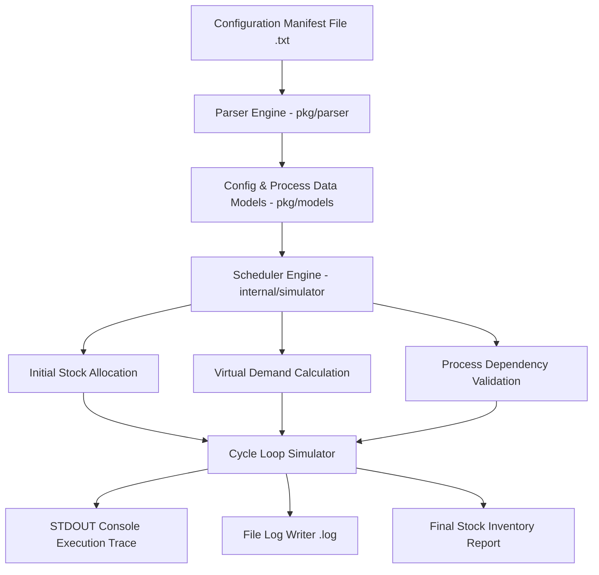
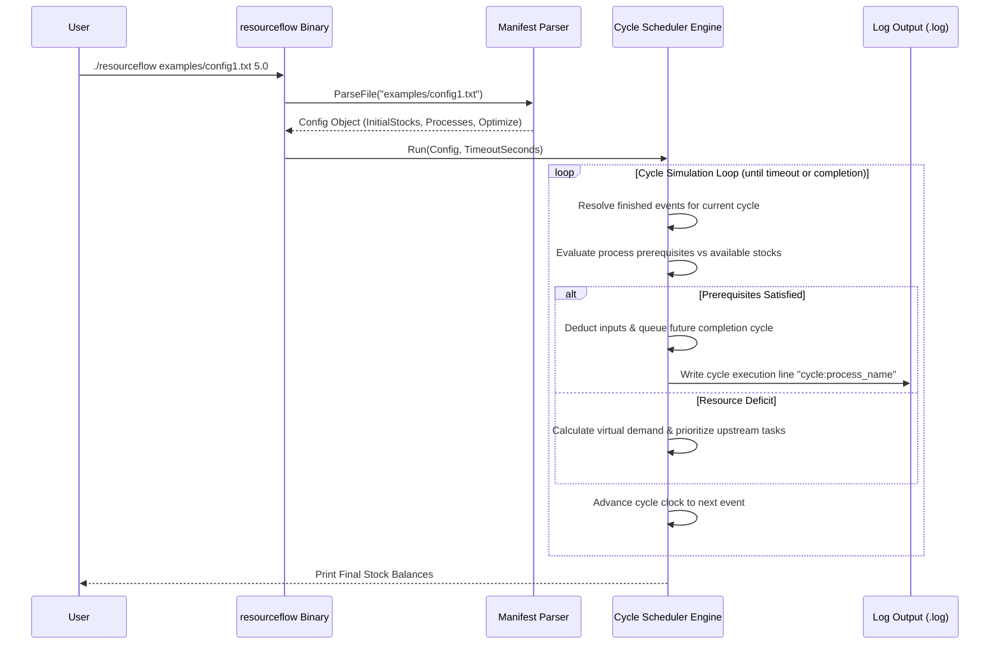

# 📈 ResourceFlow

[](https://go.dev)
[](LICENSE.md)

**ResourceFlow** is an algorithmic process scheduling and resource allocation optimization simulator implemented in Go. Designed for supply chain processes, manufacturing assembly lines, and inventory transformation pipelines, ResourceFlow reads dependency configurations, calculates optimal cycle execution orders, enforces resource constraints, and logs detailed timeline events.

---

## ⚡ Key Highlights

- **Process Dependency Graph Parsing**: Parses complex configuration manifests defining initial resource stocks, production duration cycles, input prerequisites, and output yields.
- **Dynamic Virtual Demand Scheduler**: Computes virtual stock demands across cycles to unblock dependent downstream processes and prevent starvation.
- **Cycle-Accurate Event Simulation**: Simulates production cycles step-by-step with log trace output generation (`<config_file>.log`).
- **Resource Inventory Tracking**: Tracks real-time stock balances, in-progress allocations, and final inventory tallies.
- **Automated Verification Engine**: Built-in checker tool (`checker/main.go`) to validate execution logs against original process constraints.

---

## 📋 Table of Contents

- [Key Highlights](#-key-highlights)
- [System Architecture](#-system-architecture)
- [Simulation Scheduling Sequence](#-simulation-scheduling-sequence)
- [Setup & Execution](#-setup--execution)
- [Project Directory Structure](#-project-directory-structure)
- [License](#-license)

---

## 🏗️ System Architecture



---

## 🖥️ Live Terminal Simulation Trace Preview

Below is a trace of ResourceFlow executing a multi-step manufacturing process simulation, tracking stock inventory flow and writing trace logs:

```text
$ ./resourceflow examples/example1.txt 5.0

[ResourceFlow Simulator v1.0.0]
 -> Parsing manifest: examples/example1.txt
 -> Initial Inventory: { iron_ore: 50, coal: 30, furnace: 1 }
 -> Target Stock: { steel_ingot: 20 }
 -> Scheduler timeout: 5.00s

[Cycle 000] Process 'smelt_iron' STARTED  (Consumes: 2 iron_ore, 1 coal | Duration: 2 cycles)
[Cycle 001] Process 'smelt_iron' RUNNING  (In-progress: 1 unit)
[Cycle 002] Process 'smelt_iron' FINISHED (Yielded: 1 steel_ingot)
[Cycle 002] Process 'smelt_iron' STARTED  (Consumes: 2 iron_ore, 1 coal | Duration: 2 cycles)
...
[Cycle 040] Target inventory reached!

=================== FINAL INVENTORY REPORT ===================
 -> steel_ingot : 20 [TARGET REACHED]
 -> iron_ore    : 10
 -> coal        : 10
 -> furnace     : 1
=============================================================
Log trace written to: examples/example1.txt.log


---

## 📐 Simulation Scheduling Sequence



---

## 🚀 Setup & Execution

### Prerequisites

- **Go**: Version 1.20 or newer installed.

---

### Build & Run

1. **Clone Repository**:
   ```bash
   git clone https://github.com/sahmedhusain/resourceflow.git
   cd resourceflow
   ```

2. **Compile Application**:
   ```bash
   go build -o resourceflow main.go
   go build -o checker checker/main.go
   ```

3. **Run Simulation**:
   ```bash
   ./resourceflow examples/example1.txt 5.0
   ```
   *Arguments: `<config_path> <timeout_in_seconds>`*

4. **Verify Simulation Log**:
   ```bash
   ./checker examples/example1.txt examples/example1.txt.log
   ```

---

## 📂 Project Directory Structure

```
resourceflow/
├── main.go                     # Application entrypoint & CLI argument parser
├── go.mod                      # Go module manifest (module resourceflow)
├── README.md                    # Documentation
├── checker/
│   └── main.go                 # Simulation trace validator binary
├── examples/                   # Configuration test scenarios & sample manifests
├── internal/
│   └── simulator/
│       └── scheduler.go        # Cycle scheduler engine & demand resolver
└── pkg/
    ├── models/                 # Process, Config, and Event data structures
    └── parser/                 # Configuration file lexer & parser
```

---

## 📄 License

Distributed under the MIT License. See [LICENSE](LICENSE.md) for details.